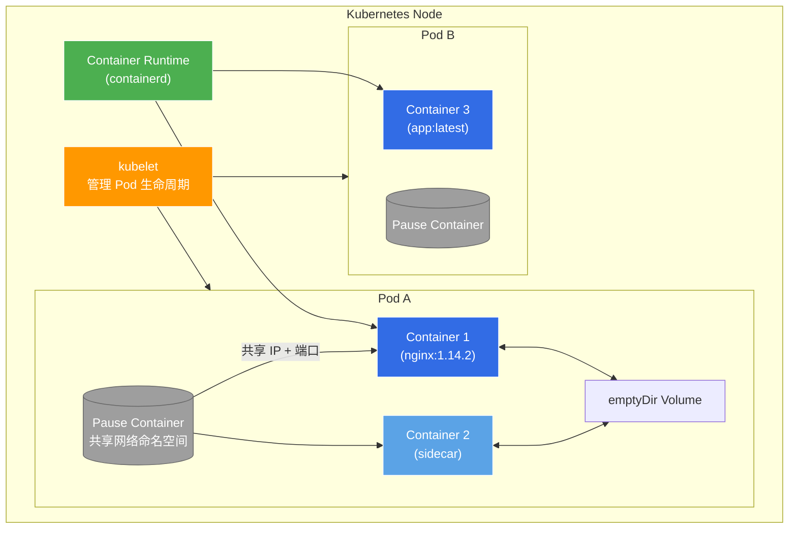
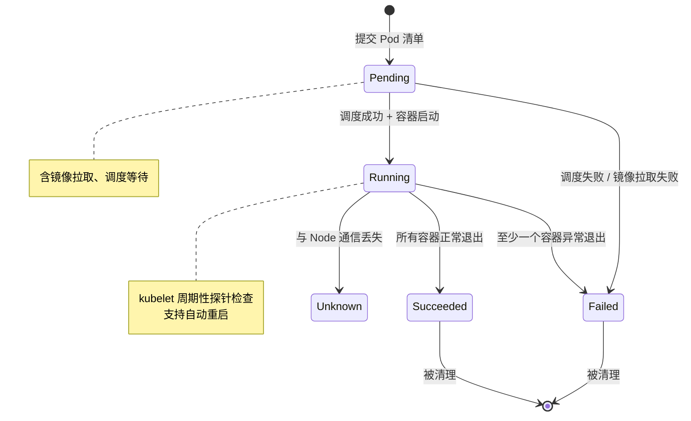
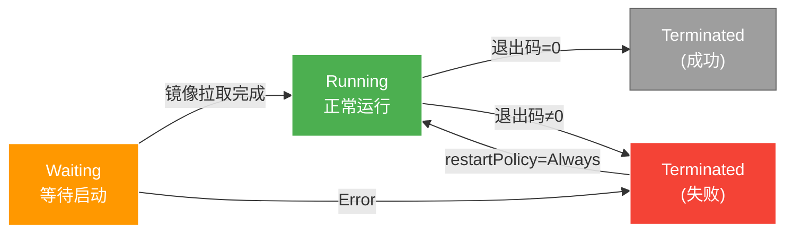

# Kubernetes Pod 基础

## 概述

**Pod** 是 Kubernetes 中最小的可部署计算单元，是一组共享存储和网络资源的容器集合。可以把 Pod 理解为"逻辑主机"——同一个 Pod 内的容器共享同一份网络栈（IP + 端口空间）和存储卷，总是被协同调度到同一个节点上。

> 📌 官方定义：_Pods are the smallest deployable units of computing that you can create and manage in Kubernetes._

---

## 架构图



### 核心要点

| 特性       | 说明                                   |
| -------- | ------------------------------------ |
| **最小单元** | Pod 是 K8s 的最小调度单位，不是容器               |
| **共享网络** | 同一 Pod 内的容器共享 IP、端口空间（通过 pause 容器实现） |
| **共享存储** | 可通过 Volume 在容器间共享数据                  |
| **同节点**  | Pod 内的所有容器始终运行在同一 Node 上             |
| **临时性**  | Pod 是相对临时的实体，不会"重新调度"到其他节点           |

---

## Pod 生命周期（Phase）



| Phase | 含义 | 常见原因 |
|-------|------|---------|
| **Pending** | Pod 已被集群接受，但容器尚未就绪 | 镜像拉取中、资源不足等待调度 |
| **Running** | Pod 已绑定到节点，至少一个容器在运行 | — |
| **Succeeded** | 所有容器成功退出（Job 类 Pod） | 批处理任务完成 |
| **Failed** | 容器异常退出 | 应用崩溃、OOM、健康检查失败 |
| **Unknown** | 无法获取 Pod 状态 | Node 失联、kubelet 停止响应 |

---

## 容器状态

除了 Pod 级别的 Phase，每个容器还有更细粒度的状态：



常用检查命令：

```bash
# 查看 Pod 状态
kubectl get pods
kubectl describe pod <pod-name>

# 查看容器级别状态
kubectl get pod <pod-name> -o jsonpath='{.status.containerStatuses}'
```

---

## 常见问题与解决方案

| 问题 | 表象 | 原因 | 解决方案 | 官方参考 |
|------|------|------|---------|---------|
| **Pod 卡在 Pending** | `kubectl get pods` 显示 Pending | 资源不足（CPU/内存）、节点选择器无匹配、PVC 未就绪 | `kubectl describe pod` 看 Events → 检查节点资源、修正 nodeSelector | [Debug Pods](https://kubernetes.io/docs/tasks/debug/debug-application/debug-pods/) |
| **CrashLoopBackOff** | Pod 反复重启 | 应用启动失败、配置错误、依赖服务未就绪 | `kubectl logs <pod>` 查看日志 → `kubectl describe pod` 查看最后状态 | [Pod Lifecycle](https://kubernetes.io/docs/concepts/workloads/pods/pod-lifecycle/) |
| **ImagePullBackOff** | 镜像拉取失败 | 镜像名错误、私有仓库未认证、镜像不存在 | 检查镜像名拼写、配置 imagePullSecrets、验证仓库地址 | [Images](https://kubernetes.io/docs/concepts/containers/images/) |
| **OOMKilled** | Pod 被 OOM Kill | 容器内存超限 | 调整 resources.limits.memory、优化应用内存使用 | [Resource Limits](https://kubernetes.io/docs/concepts/configuration/manage-resources-containers/) |
| **Node 失联** | Pod 状态变为 Unknown | Node 宕机、kubelet 停止、网络分区 | 恢复节点 → Pod 自动迁移（被 controller 重建） | [Node Controller](https://kubernetes.io/docs/concepts/architecture/nodes/) |
| **Pod 一直在 Terminating** | 删除卡住 | 容器忽略 SIGTERM、finalizer 未清理 | `kubectl delete pod --force --grace-period=0` | [Force Delete](https://kubernetes.io/docs/concepts/workloads/pods/pod-lifecycle/#pod-termination-forced) |

---

## 官方最佳实践

来自 [Kubernetes Official Documentation](https://github.com/kubernetes/website)

### 1. 不要直接创建 Pod

除非有特殊理由（如 static Pod），否则始终通过 **Deployment、StatefulSet、DaemonSet、Job** 等 Workload 资源创建 Pod。控制器会替你处理滚动更新、扩缩容、自愈。

```yaml
# ✅ 正确做法
apiVersion: apps/v1
kind: Deployment
spec:
  replicas: 3
  template:
    spec:
      containers:
      - name: app
        image: nginx:1.14.2
```

### 2. 合理设置资源请求与限制

- **`requests`**：调度依据，保证 Pod 能获得的最小资源
- **`limits`**：运行限制，超过即 OOMKill 或限流
- **黄金法则**：`requests` ≤ `limits`，生产环境两者都应设置

```yaml
resources:
  requests:
    memory: "256Mi"
    cpu: "250m"
  limits:
    memory: "512Mi"
    cpu: "500m"
```

### 3. 配置健康检查探针

| 探针类型 | 作用 | 何时检测 |
|---------|------|---------|
| **livenessProbe** | 容器是否存活 | 整个生命周期，失败则重启容器 |
| **readinessProbe** | 容器是否就绪 | 整个生命周期，失败则从 Service 端点移除 |
| **startupProbe** | 容器是否已启动 | 启动阶段，成功前禁用 liveness/readiness |

```yaml
readinessProbe:
  httpGet:
    path: /healthz
    port: 8080
  initialDelaySeconds: 5
  periodSeconds: 10
```

### 4. 使用多容器 Pod 的原则

多容器共用一个 Pod 只适用于**紧耦合**场景，如：
- **Sidecar**：日志收集、代理转发
- **Adapter**：格式转换
- **Ambassador**：代理连接外部服务

如果只是为了高可用或扩展，应使用 Deployment + Replicas，而非多容器。

### 5. 正确设置 Pod 的 OS 字段（v1.25+）

```yaml
spec:
  os:
    name: linux  # 或 windows
```

kubelet 会拒绝与节点 OS 不匹配的 Pod。

---

## 排查命令速查表

```bash
# 查看 Pod 列表（含状态）
kubectl get pods -o wide

# 查看 Pod 详细信息（Events 是排错关键）
kubectl describe pod <name>

# 查看容器日志
kubectl logs <name> [-c container-name]
kubectl logs --previous <name>   # 上次启动的日志

# 进入 Pod 调试
kubectl exec -it <name> -- /bin/sh

# 查看 Pod 的 YAML（含实际状态）
kubectl get pod <name> -o yaml

# 查看节点资源使用
kubectl top node
kubectl top pod
```

---

## 相关笔记

- [[Kubernetes Deployment 详解]]
- [[Docker 容器基础]]
- [[K8s Service 网络模型]]
- [[K8s 存储之 PV 与 PVC]]

---

> 📚 本文内容来源于 [Kubernetes 官方文档](https://kubernetes.io/docs/concepts/workloads/pods/) (kubernetes/website GitHub 仓库)，遵循官方最佳实践。
