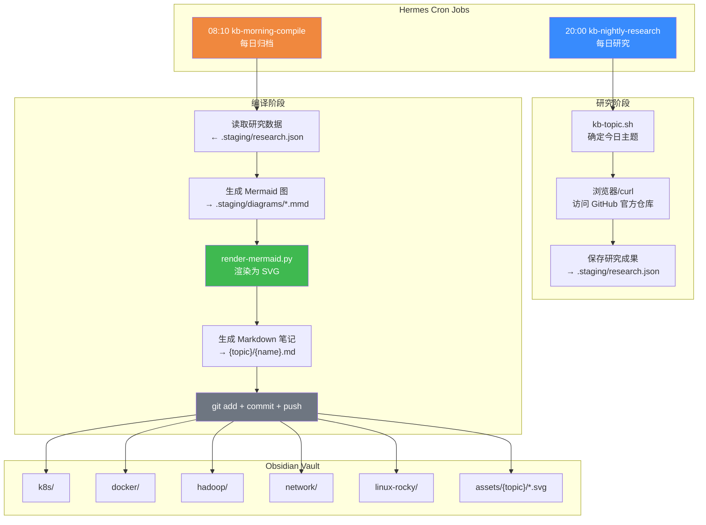

# 自动研究知识库 — 原理与架构说明

> 本文档记录知识库自动化系统的完整架构、原理和工作流程。

---

## 一、系统总览

### 目标

每天晚上 20:00 自动从 GitHub 官方仓库学习知识，每天早上 08:10 生成结构化笔记推送到 Obsidian 知识库。

### 核心理念

```
GitHub 官方源码/文档  ──研究──►  结构化 JSON  ──编译──►  Obsidian Markdown 笔记
                                          │                      │
                                          ▼                      ▼
                                    .staging/              知识分类目录/
                                    research.json          assets/{topic}/*.svg
```

**零提供商锁定**：所有操作通过文件系统和 git CLI 完成，与任何 LLM 提供商无关。

---

## 二、主题轮转机制

根据 `skill/scripts/kb-topic.sh`，7 天一循环：

| 星期 | 主题 | 优先级 | 目录 | 图片主题色 |
|------|------|--------|------|-----------|
| 一 | Kubernetes 基础 | 🔴最高 | k8s | 深海蓝 `#0d1117` |
| 二 | Docker | 🔴最高 | docker | 碧海青 `#0f172a` |
| 三 | Hadoop 生态 | 🟡中 | hadoop | 琥珀暖 `#1a1410` |
| 四 | 网络 | 🟡中 | network | 翠林绿 `#0f1a15` |
| 五 | Rocky Linux | 🟢低 | linux-rocky | 苍岭灰 `#111815` |
| 六 | K8s 实战场景 | 🔴最高 | k8s | 深海蓝 |
| 日 | Docker 进阶 | 🔴最高 | docker | 碧海青 |

---

## 三、架构图



---

## 四、核心组件详解

### 4.1 研究阶段 (20:00)

**入口**：`kb-nightly-research` cron job

**流程**：
1. 执行 `kb-topic.sh` 获取今日主题
2. 访问对应 GitHub 官方仓库（如 kubernetes/website、docker/docs、apache/hadoop）
3. 通过浏览器工具浏览官方文档、Issues 中的常见问题
4. 提取核心概念、常见问题与解决方案、官方最佳实践
5. 结构化为 JSON 存入 `.staging/research.json`

**输出格式**：
```json
{
  "topic": "Kubernetes",
  "subtopic": "Pod 基础概念",
  "directory": "k8s",
  "priority": "🔴最高",
  "content": {
    "overview": "...",
    "core_concepts": [...],
    "common_issues": [...],
    "best_practices": [...]
  }
}
```

### 4.2 编译阶段 (08:10)

**入口**：`kb-morning-compile` cron job

**流程**：
1. 读取 `.staging/research.json`
2. 根据 `directory` 确定保存路径和图片主题色
3. 生成 1-3 张 Mermaid 架构图/流程图
4. 调用 `render-mermaid.py` 渲染为 SVG 矢量图
5. 保存到 `assets/{directory}/`，图片名见名知意
6. 生成完整 Markdown 笔记，用 `![[assets/...]]` 引用图片
7. `git add -A && git commit && git push`

### 4.3 图片渲染引擎

**脚本**：`skill/scripts/render-mermaid.py`

**工作原理**：
```
Mermaid DSL  ──base64──►  mermaid.ink API  ──SVG──►  文件系统
```

**主题系统**：根据输出路径 `assets/{topic}/` 中的目录名自动匹配：

| 目录 | 主题名 | 子图背景 |
|------|--------|---------|
| k8s | Ocean Blue 深海蓝 | `#0d1117` |
| docker | Teal Cyan 碧海青 | `#0f172a` |
| hadoop | Amber Warm 琥珀暖 | `#1a1410` |
| network | Forest Emerald 翠林绿 | `#0f1a15` |
| linux-rocky | Slate Sage 苍岭灰 | `#111815` |

**智能检出**：如果 Mermaid 代码中有自定义 `style fill:`，则只设子图背景色，不覆盖节点颜色；无自定义样式时应用完整主题。

### 4.4 Git 版本控制

所有笔记和图片通过 git 管理，每次编译完成自动推送：

```bash
git add -A
git commit -m "feat: YYYY-MM-DD {topic} 知识笔记"
git push
```

远程仓库：`git@github.com:PeteWangS/knowledge-base.git`

---

## 五、目录结构规范

```
knowledge-base/
├── k8s/                    # Kubernetes 笔记
│   └── *.md
├── docker/                 # Docker 笔记
├── hadoop/                 # Hadoop 生态笔记
├── network/                # 网络笔记
├── linux-rocky/            # Rocky Linux 笔记
├── assets/
│   ├── k8s/                # K8s 相关 SVG 图片
│   ├── docker/
│   ├── hadoop/
│   ├── network/
│   └── linux-rocky/
├── skill/                  # 本技能文档
│   ├── README.md           # ← 本文档
│   ├── SKILL.md            # Hermes 可加载的 skill
│   └── scripts/
│       ├── kb-topic.sh     # 主题轮转脚本
│       └── render-mermaid.py # Mermaid → SVG 渲染器
├── .obsidian/              # Obsidian 配置（自动管理）
├── .staging/               # 研究阶段临时文件（自动管理）
└── .gitignore
```

---

## 六、管理命令

```bash
# 查看 cron job 状态
cronjob action=list

# 手动触发研究
cronjob action=run job_id=ba41b0c5a996

# 手动触发归档
cronjob action=run job_id=e4bb9f117f45

# 查看主题轮转
bash ~/.hermes/scripts/kb-topic.sh

# 测试渲染一张图
python3 ~/.hermes/scripts/render-mermaid.py diagram.mmd assets/k8s/diagram.svg
```

---

## 七、故障处理

| 问题 | 原因 | 解决 |
|------|------|------|
| 研究阶段浏览器超时 | 网络限制 | 换用 curl 获取原始内容 |
| 渲染失败 HTTP 403 | mermaid.ink 限流 | 等几分钟重试 |
| git push 失败 | 网络、权限 | 检查 SSH key、重试 |
| 笔记中图片不显示 | 路径错误 | 确认用 `![[assets/{topic}/file.svg]]` |

---

> 📅 建立日期：2026-07-24  
> 🔄 更新：随流水线自动运行，无需手动维护
